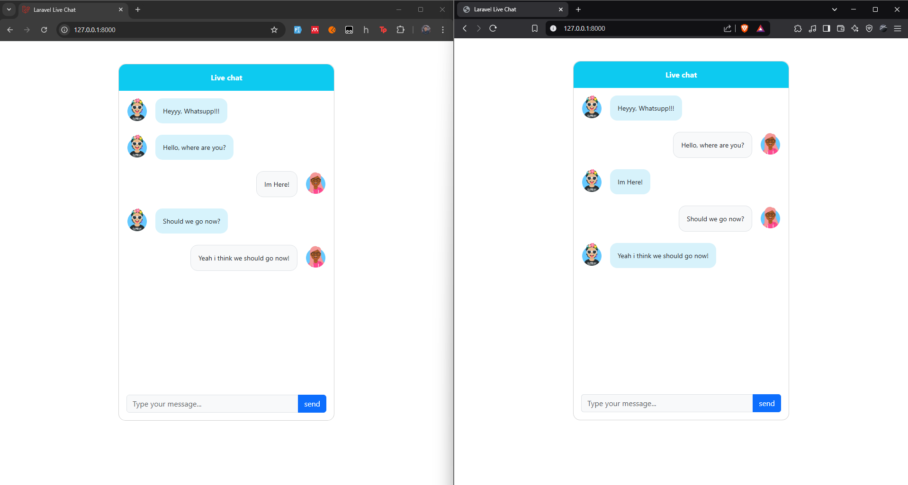

<p align="center"><a target="_blank"></a></p>

# Laravel Live Chat Application

A real-time messaging application built using Laravel and Pusher.

## Table of Contents

1. [Description](#description)
2. [Installation](#installation)
3. [Setup](#setup)
4. [Configuration](#configuration)
5. [Technologies](#technologies)
6. [Contributing](#contributing)
6. [Credit](#credit)

## Description

This application provides a real-time chat functionality using Laravel 11 and Pusher. Users can send and receive messages in real-time, making it ideal for applications requiring instant communication.

## Installation

1. Clone the repository:
    ```bash
    git clone https://github.com/kiriseka/laravel-live-chat-app.git
    ```

2. Install dependencies: 
    ```bash
    composer install
    ```


## Setup

Copy the .env.example file and create a new .env file.
```bash
cp .env.example .env
Generate the Laravel application key:
```

Generate the Laravel application key:
```bash
php artisan key:generate
```

Install Node.js Dependencies
```bash
npm install
npm run dev
```

Since this is Laravel 11, so for broadcasting, you need to install broadcasting in laravel: 
```bash
php artisan install:broadcasting
```


## Configuration

Set Up Pusher
You need a Pusher account to broadcast messages. Create an account at Pusher and get your credentials.

Instal the pusher PHP Server:
```bash
composer require pusher/pusher-php-server
```

Update the .env file with your Pusher credentials:
```bash
PUSHER_APP_ID=your_app_id
PUSHER_APP_KEY=your_app_key
PUSHER_APP_SECRET=your_app_secret
PUSHER_APP_CLUSTER=your_cluster
BROADCAST_DRIVER=pusher
```

In config/broadcasting.php, the pusher connection should be set up as follows:
```bash
'connections' => [
    'pusher' => [
        'driver' => 'pusher',
        'key' => env('PUSHER_APP_KEY'),
        'secret' => env('PUSHER_APP_SECRET'),
        'app_id' => env('PUSHER_APP_ID'),
        'options' => [
            'cluster' => env('PUSHER_APP_CLUSTER'),
            'useTLS' => true,
        ],
    ],
],
```

To ensure messages are processed and broadcasted in real-time, run the queue worker:
```bash
php artisan queue:work
```

## Technologies 

- Laravel: PHP web framework for building the application.
- Pusher: Real-time messaging service for broadcasting messages.
- JavaScript: Used for interacting with the backend and handling real-time events via Pusher.
- Axios: For making HTTP requests from the frontend.

## Contributing

If you want to contribute to this project, feel free to fork the repository and submit a pull request. Here are some ways you can contribute:

- Report bugs or issues.
- Suggest improvements or features.
- Help with documentation or translations.
- FEEL FREE TO USE THIS PROJECT FOR ANYTHING!

## Credit

Html Template for chat interface that i used:
https://mdbootstrap.com/docs/standard/extended/chat/

This project also inspired from this video which you can also check out this video:
https://www.youtube.com/watch?v=ER-wOKXrbuw